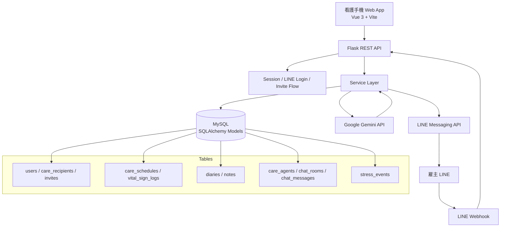

# 404: Care Can Be Found

## 問題與目標

外籍家庭看護長期面臨高工時、語言與權力落差，照護壓力與需求往往難以被表達，也不容易主動求助。

「照見」希望成為看護與雇主之間低摩擦、安全的照護溝通工具。 看護透過手機 Web App，以熟悉的語言與 Care Agent 對話，協助整理情緒、釐清照護情境與實際需求，並在異常狀況下提供關懷提醒；同時整合秘密日記、共享便利貼、健康紀錄與每日排程，讓照護資訊集中管理。

雇主端則透過 LINE 官方帳號接收必要的照護摘要與提醒，不需額外學習複雜系統，同時避免過度揭露看護的私密內容。

我們希望透過「照見」，降低跨語言溝通成本、讓需求更容易被說出口，並及早看見照護現場中的高壓訊號。

## 核心功能

- 看護端五個主要分頁：照護 Dashboard、秘密日記、Care Agent 對話、交流板、帳戶管理
- 雇主邀請連結：雇主產生 `/auth/invite/:code`，看護打開後直接接受邀請並建立 session
- Care Agent：根據照護背景、baseline、guardrail 產生日常陪伴與照護建議
- 高壓訊號偵測：私密日記與聊天可觸發壓力事件，只推播異常筆數與建議行動，不傳原文
- LINE 雇主通道：雇主不用安裝 App，透過 LINE 接收照護摘要、壓力提醒與交流板訊息

## 系統架構



前端是 Vue 3 SPA，負責手機版互動流程與多語 UI。後端是 Flask App Factory + Service Layer，統一處理 session、API 權限、資料驗證、LINE webhook、AI 呼叫與資料寫入。資料庫使用 MySQL，schema 由 SQLAlchemy models 定義，Flask-Migrate / Alembic 管理 migration。

AI 模型主要用於 Care Agent 回覆、照護資訊抽取與高壓訊號判定。LINE 同時扮演登入/雇主端通知通道；看護的私密日記與聊天原文不會被推送給雇主。

更完整的多檔案規劃與後端模組設計請見：[backend/docs/architecture.md](backend/docs/architecture.md)。

## 使用技術

| 類型 | 技術／服務 | 用途 |
| --- | --- | --- |
| AI 模型 | Google Gemini API | Care Agent 回覆、照護摘要生成、壓力訊號判定 |
| 前端 | Vue 3, TypeScript, Vite, Vue Router, Pinia, Tailwind CSS v4 | 手機版看護 Web App、登入與邀請流程、五個功能分頁 |
| 後端 | Python, Flask, flask-smorest, Flask-SQLAlchemy, Flask-Migrate, Marshmallow, PyMySQL, pytest | REST API、資料模型、migration、驗證、測試 |
| 資料庫 | MySQL | 儲存使用者、照護對象、日記、聊天室、便利貼、壓力事件 |
| 外部服務 | LINE Login, LINE Messaging API | 使用者登入、雇主端 LINE webhook 與推播 |
| Sponsor 技術 | - | - |

## 安裝與執行

### 1. 取得專案

```bash
git clone <repo-url>
cd 404-Care-Not-Found
git checkout main
```

### 2. 啟動後端

```bash
cd backend
python -m venv .venv

# macOS / Linux
source .venv/bin/activate

# Windows PowerShell
# .\.venv\Scripts\Activate.ps1

pip install -r requirements.txt
cp .env.example .env
```

請在 `.env` 設定資料庫與外部服務。不要提交 `.env`、金鑰、token 或個人資料。

```env
DB_SERVER=127.0.0.1
DB_USER=root
DB_NAME=hackathon
DB_PASSWORD=your_password

LINE_CHANNEL_ACCESS_TOKEN=
LINE_CHANNEL_SECRET=
LINE_LOGIN_CHANNEL_ID=
LINE_LOGIN_CHANNEL_SECRET=
GOOGLE_API_KEY=
```

套用 migration 並啟動 API：

```bash
flask --app main db upgrade
flask --app main run --debug
```

後端預設提供：

- Health check: `GET /api/health`
- Swagger UI: `GET /api/docs/swagger`
- OpenAPI JSON: `GET /api/docs/openapi.json`

### 3. 啟動前端

```bash
cd ../frontend
npm ci
cp .env.example .env
```

設定前端 API 位置：

```env
VITE_API_BASE_URL=http://localhost:5000
```

啟動開發伺服器：

```bash
npm run dev
```

前端預設網址是 `http://localhost:5173`。

### 4. 測試與建置

```bash
# 後端
cd backend
python -m pytest

# 前端
cd ../frontend
npm run build
```

## 作品展示

- 評選影片：https://www.youtube.com/shorts/UYgZgZ49WNw

## 限制與未來工作

目前 MVP 主要完成看護端 Web App、後端 API、邀請連結、LINE Login 基礎流程、Care Agent 對話與部分壓力事件紀錄。雇主端以 LINE 為主，但完整的 rich menu、訊息互動與正式推播節流仍可再加強。

已知限制包含：LINE 與 Google API 需要正式環境變數才能完整運作；部分 AI 流程仍依賴外部模型穩定性；LINE Messaging API 無法直接提供「使用者已讀某則推播」事件，因此便利貼已讀狀態未來可能要用點擊連結或回覆事件替代。

後續方向包含：更多來源國語言、語音輸入與 ASR、照護知識庫、雇主端摘要模板、多照護者/多家屬權限模型、訂閱方案限制、正式部署監控與資料隱私稽核。

## 第三方服務、資料與素材

| 來源 | 連結 | 用途 | 授權／注意事項 |
| --- | --- | --- | --- |
| LINE Developers | https://developers.line.biz/ | LINE Login、Messaging API、Webhook | 依 LINE Developers Terms 使用；不得提交 channel secret/access token |
| Google AI for Developers | https://ai.google.dev/ | Gemini 模型呼叫 | 依 Google API Terms 使用；不得提交 API key |
| Vue | https://vuejs.org/ | 前端框架 | MIT License |
| Vite | https://vite.dev/ | 前端開發與建置工具 | MIT License |
| Tailwind CSS | https://tailwindcss.com/ | UI styling | MIT License |
| Flask | https://flask.palletsprojects.com/ | 後端 Web framework | BSD-3-Clause License |
| SQLAlchemy | https://www.sqlalchemy.org/ | ORM / models | MIT License |
| Alembic / Flask-Migrate | https://alembic.sqlalchemy.org/ | Database migration | MIT License |

本 repo 不應提交 `.env`、資料庫密碼、LINE token、Google API key、真實使用者資料或可識別個資。

## 團隊成員
按字母順序排序

| 姓名 | 分工 |
| --- | --- |
| [Bradon](https://github.com/bradon0asd) |後端架構設計、API 功能開發、前後端整合 |
| [Daniel](https://github.com/daniellife624) |UI/UX 設計、產品功能發想、前端功能實作、Demo 影片剪輯 |
| [William](https://github.com/smileakklpl) | LLM Service 開發與整合、Agent 對話流程設計與串接、Prompt 設計與結構化輸出實作 |
| [Willy](https://github.com/weiLiao225) | LINE Bot 開發與部署、Webhook / Messaging API 串接  |
| 冠冠 | Demo 流程設計、情境腳本撰寫與錄音 |

## 授權

本專案以 MIT License 釋出，完整條款見 [LICENSE](LICENSE)。

## 補充文件

- 前端說明：[frontend/docs/overview.md](frontend/docs/overview.md)
- 後端 API：[backend/docs/api.md](backend/docs/api.md)
- 後端架構：[backend/docs/architecture.md](backend/docs/architecture.md)
- Models 與 migration：[backend/docs/models.md](backend/docs/models.md)
